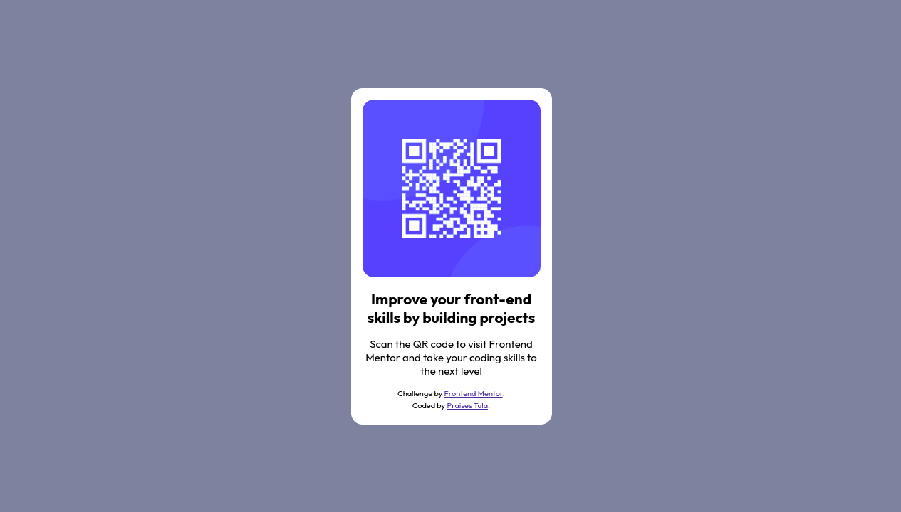

# Frontend Mentor - QR code component solution

This is a solution to the [QR code component challenge on Frontend Mentor](https://www.frontendmentor.io/challenges/qr-code-component-iux_sIO_H). Frontend Mentor challenges help you improve your coding skills by building realistic projects.

## Table of contents

- [Overview](#overview)
    - [Screenshot](#screenshot)
    - [Links](#links)
- [My process](#my-process)
    - [Built with](#built-with)
- [Author](#author)

## Overview

### Screenshot
**Mobile View**

**Desktop View**

### Links

- Solution URL: [QR Code](https://github.com/PraisesPJMT/QR-Code)
- Live Site URL: [QR Code Live](https://qr-code-five-mocha.vercel.app/)

## My process

### Built with

- Semantic HTML5 markup
- CSS custom properties
- Flexbox
- CSS Grid
- Mobile-first workflow

## Author

- Website - [Praises Tula](https://github.com/PraisesPJMT)
- Frontend Mentor - [@PraisesPJMT](https://www.frontendmentor.io/profile/PraisesPJMT)
- Twitter - [@PraisesPJMT](https://twitter.com/PraisesPJMT)

